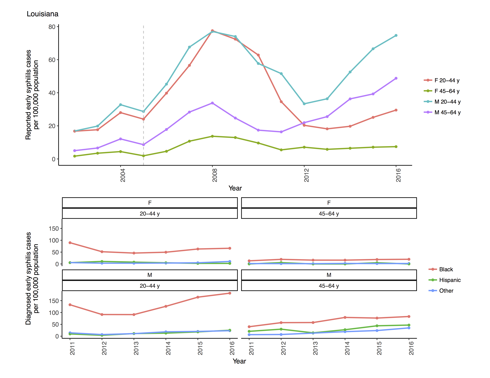
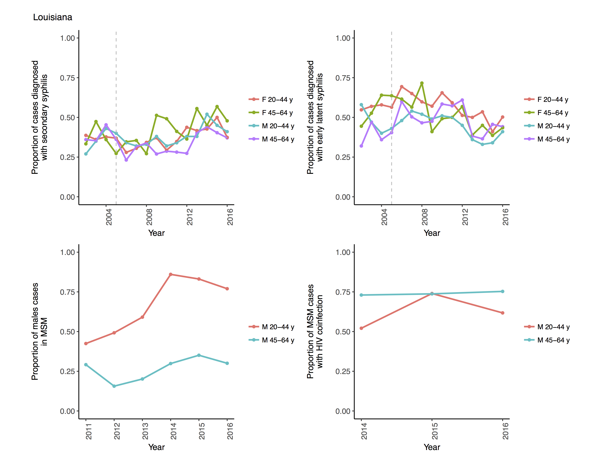
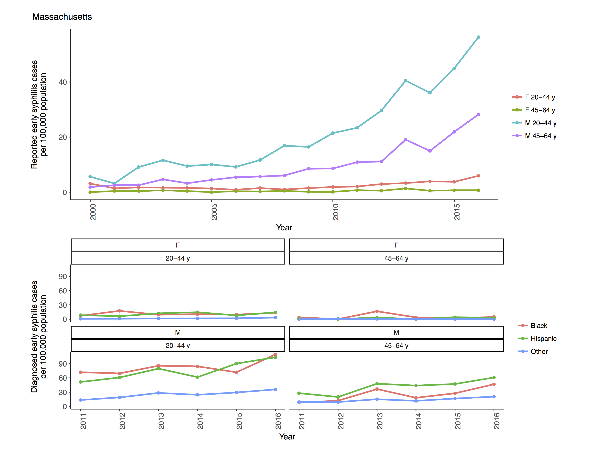
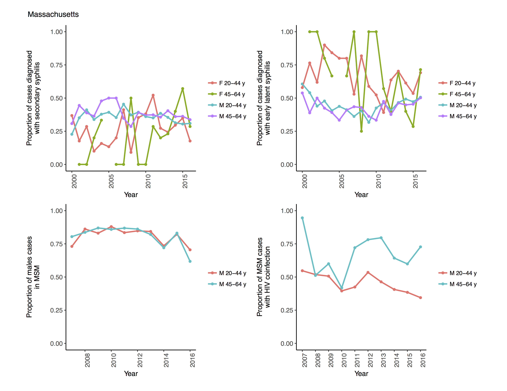

The purpose of this document is to provide figures and tables which could be 
included in our research manuscript in an organized fashion. 

This mini-manuscript is divided into the following sections: 

  - Introduction
  - Background
  - Methodology
    - Model Calibration
    - Intervention Scenario Simulation
  - Results
    - Calibration Findings
    - Intervention Simulation Findings
  - Analysis
    - How could interventions which increase screening cause an increase in prevalence?
    - Why do LA and MA behave so differently under different intervention scenarios? 

# Introduction

# Background 

Let me know if we'd like to include any plots of the longer time trends (from 
before and including our data calibration time period) and I 
can make any formatting adjustments we'd want to these kinds of plots:

# Methodology 

## Methodology – Model Calibration 

See priors/posteriors plots in the figures/calibration_plots/ folder.

## Methodology – Intervention Scenario Simulation

# Results

## Results – Calibration Findings

I think it would be nice to present model estimated: Incidence, Prevalence,
Diagnosis, Screening, Partnership Rates at least by sex and/or race/ethnicity,
or for every compartment

## Results – Intervention Simulation Findings

I think intervention outcomes should include: Incidence, Prevalence, Additional
Tests Performed Compared to the Basecase, Number Needed to Treat to Avert One
Incident/Prevalent Infection

# Analysis

## Analysis 1 – How do interventions increase prevalence? 

We hypothesize that the interventions increase prevalence by increasing 
symptomatic prevalence due to treatment of asymptomatic infections followed
by reinfection. 
    
This is a testable hypothesis in that if we simulate an 
intervention which increases prevalence with the modification that after 
treatment individuals cannot be reinfected, and we observe that prevalence does 
not increase, this should validate our hypothesis.

## Analysis 2 – Why do Louisiana and Massachusetts behave differently in intervention scenarios?
   
We have demonstrated that the parameters of the model which most 
significantly cause the Louisiana and Massachusetts results to differ 
in terms of their prevalence outcomes due to screening interventions are 
the partnership rate parameters.

### Experimental Analysis – Can we replace parameters to make Louisiana look like Massachusetts in the MSM Annual screening scenario? 

What we've done in the following figure is simulate and record the prevalence
in Louisiana under the the MSM annual scenario (denoted 'base').  Then, we've
taken 3 sets of parameters which have been found to impact the level of
prevalence and how it responds to the screening level adjustment in the MSM
annual intervention scenario and overwritten the values in the Louisiana
optimized model parametrization with the same parameters from the Massachusetts
optimized model parametrization. 

Those sets of parameters are the parameters which control assortativity (risk
assortativity, race/ethnicity assortativity, and age assortativity),
partnership rates, and rates of self-treatment. 

As we can see, the set of parameters which causes the prevalence in Louisiana
to respond most similarly to Massachusetts in the MSM Annual intervention
scenario are the partnership rate parameters.

More on this topic may be needed.

# Conclusions
