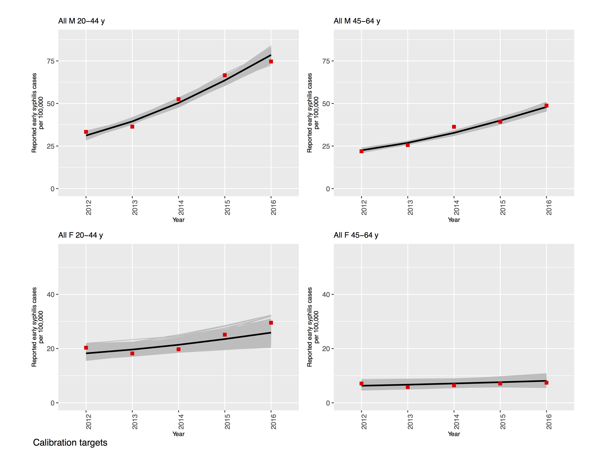
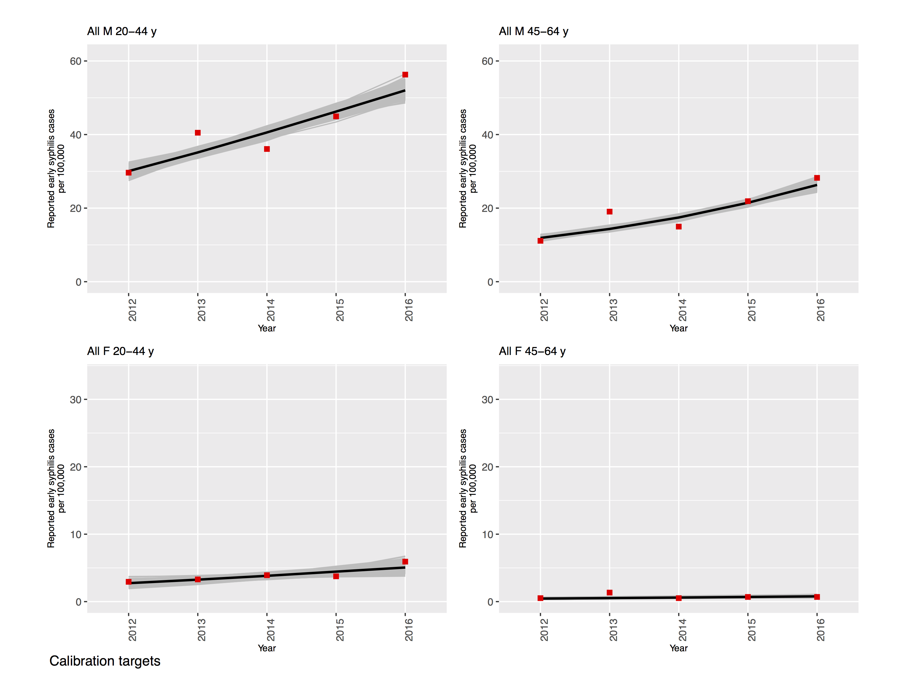
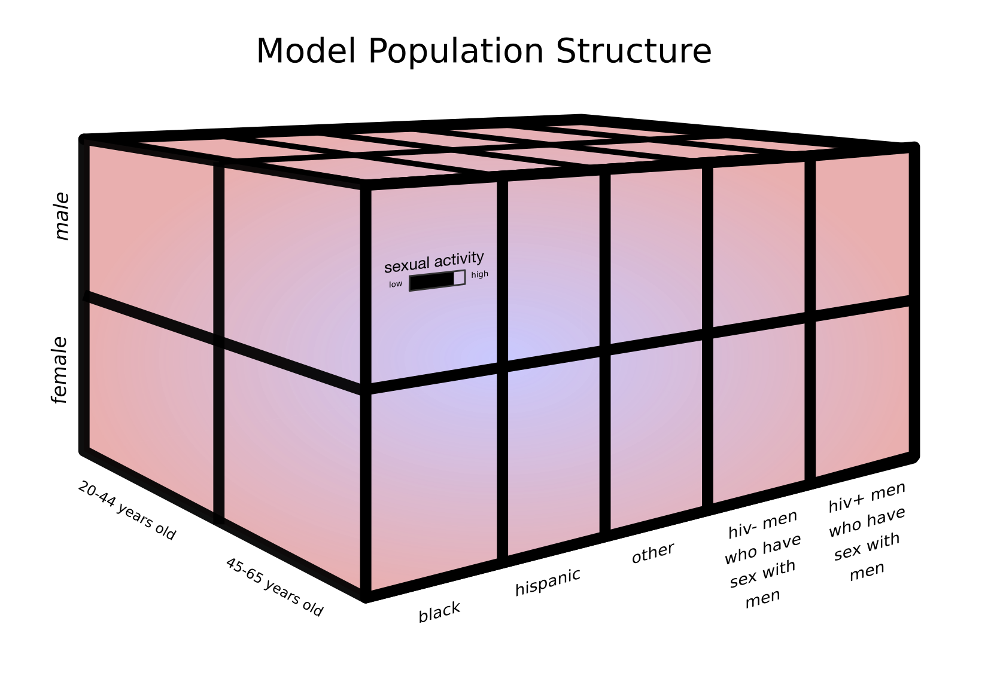
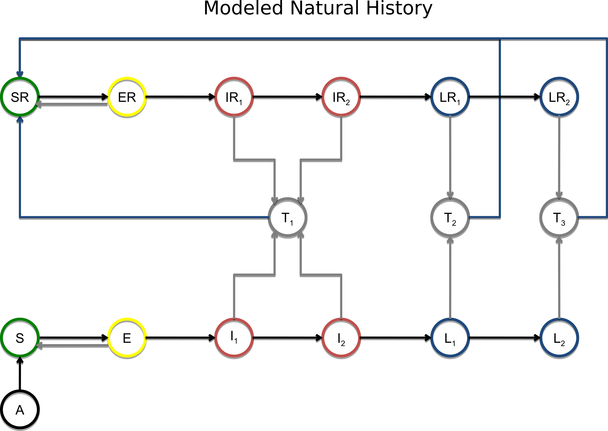
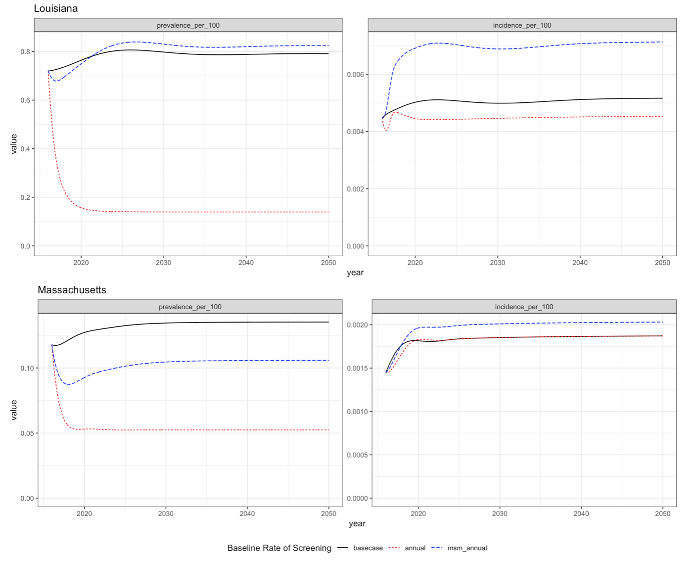

In this project we are modeling syphilis in Louisiana and Massachusetts. 

In each of these two states, we have calibrated the model and can use it to
simulate hypothetical scenarios which may yield useful insight into effective
health policy. 

This document will walk readers through the background of the model, an analysis of
hypothetical interventions, and our intentions for future developments.

## Model Background 

#### Data Being Used

Calibration targets include: 

- Reported Cases by Stage, Sex, Race
- Proportion of Male Cases Among MSM
- Proportion of Cases Among MSM with HIV Coinfection
- Subpopulation Assortative Mixing (Age, Race)

|Louisiana|Massachusetts|
|---------|-------------|
|{ width=4.5in }|{ width=4.5in }|

#### Model Structure

{ width=6in }

{ width=6in }

#### Calibration 

In order to calibrate our model, we run an optimization algorithm to determine
several parameter vectors which optimize the model fit to the prior and
likelihood distributions.  These parameter vectors are then used as the
starting places for multiple Monte Carlo Markov Chains which are used to
estimate model uncertainty.

#### Visualizations of the Modeled Epidemiology

## Analysis of Interventions

The primary research question we have been investigating has been: 

> How do interventions which are focused on raising the baseline level of
> screening in the entire population compare to interventions targeted on men who have sex
> with men (MSM) populations? 

{ width=8in }

## Future Plans
