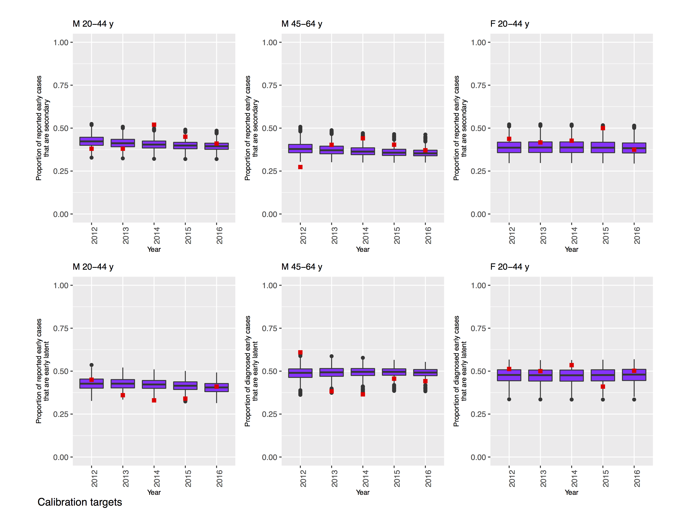
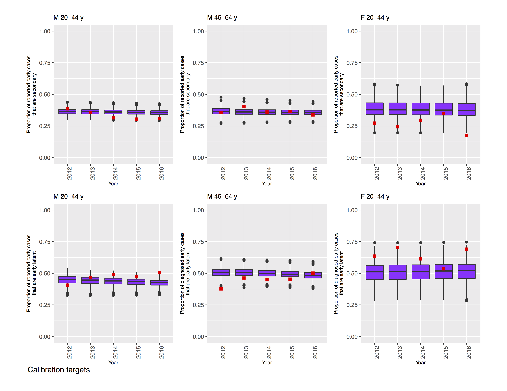
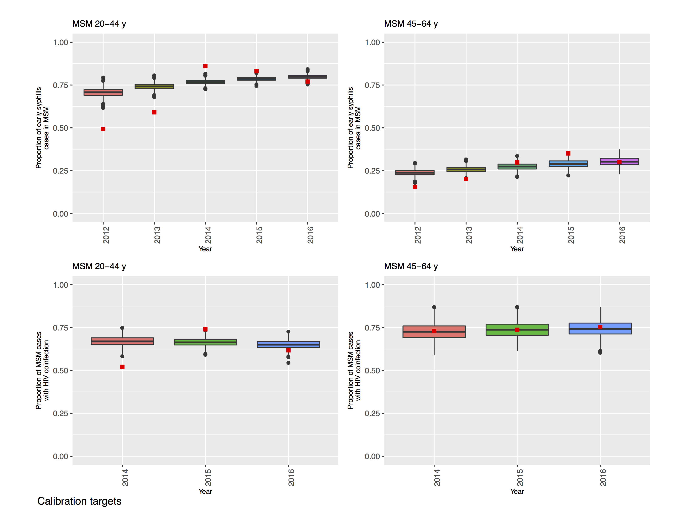
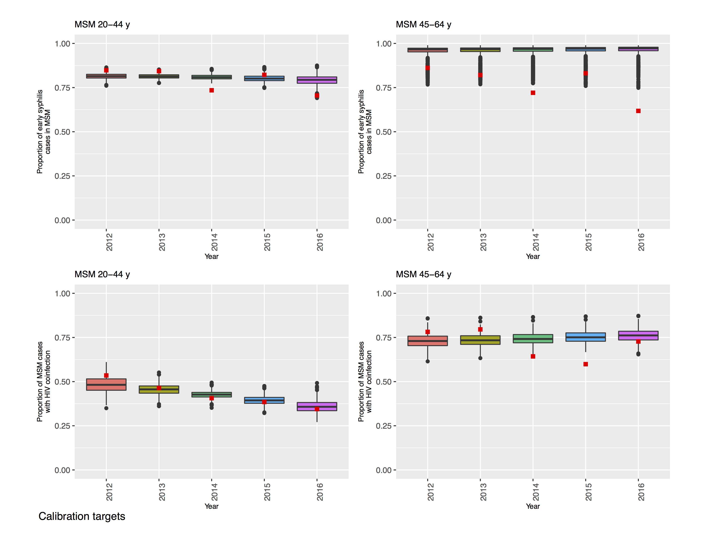
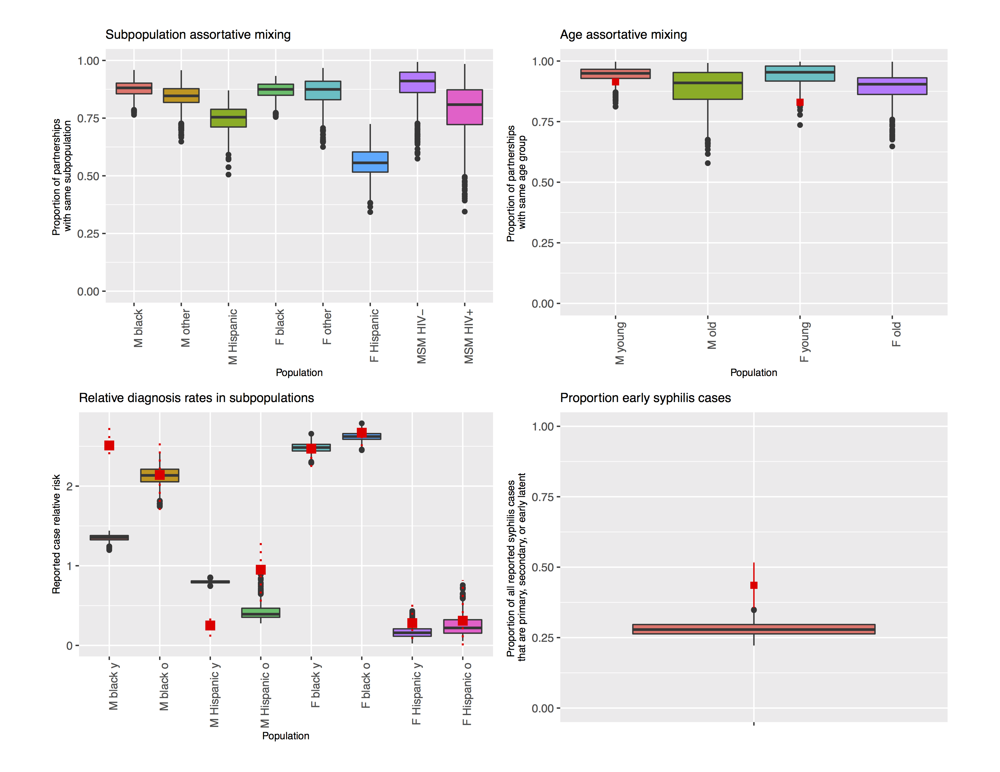
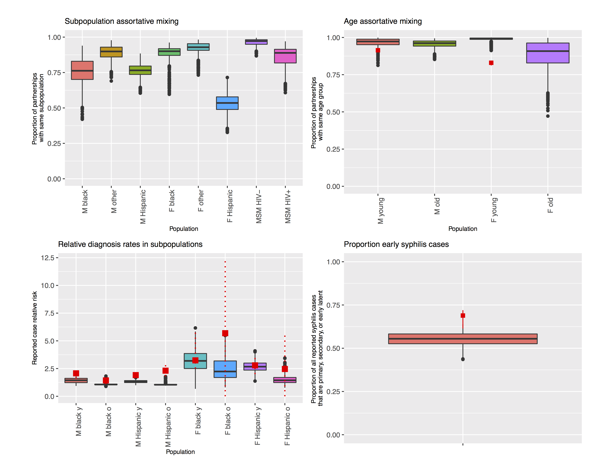

In this project we are modeling syphilis in Louisiana and Massachusetts. 

In each of these two states, we have calibrated the model and can use it to
simulate hypothetical scenarios which may yield useful insight into effective
health policy. 

This document will walk readers through the background of the model, an analysis of
hypothetical interventions, and our intentions for future developments.

## Model Background 

{ width=6in }

{ width=6in }

#### Data Being Used

Calibration targets include: 

- Reported Cases by Stage, Sex, Race
- Proportion of Male Cases Among MSM
- Proportion of Cases Among MSM with HIV Coinfection
- Subpopulation Assortative Mixing (Age, Race)

<!--   -->
<!--
<table>
<tr>
<th>
Louisiana 

</th>
<th>
Massachusetts

</th>
</tr>
</table>
-->

|Louisiana|Massachusetts|
|---------|-------------|
|{ width=4.5in }|{ width=4.5in }|
<!--|{ width=4.5in }|{ width=4.5in }|-->
<!--|{ width=4.5in }|{ width=4.5in }|-->
<!--|{ width=4.5in }|{ width=4.5in }|-->

#### Model Structure
#### Calibration Results
#### Visualizations of the Modeled Epidemiology

## Analysis of Interventions

The primary research question we have been investigating has been: 

> How do interventions which are focused on raising the baseline level of
> screening in the entire population compare to interventions targeted on men who have sex
> with men (MSM) populations? 

## Future Plans
