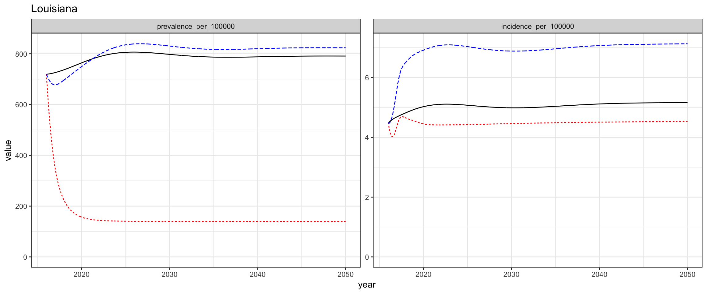
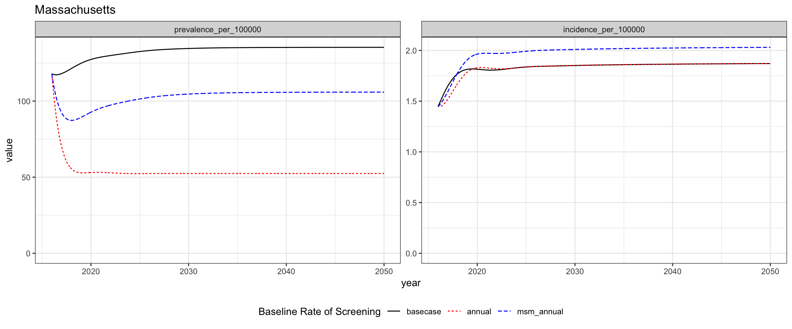
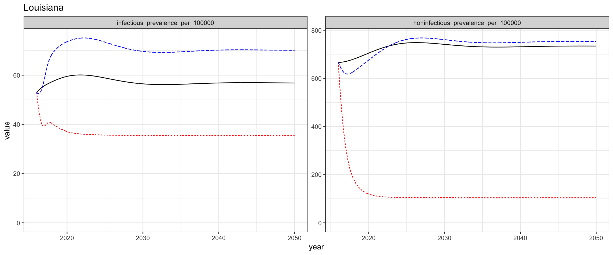
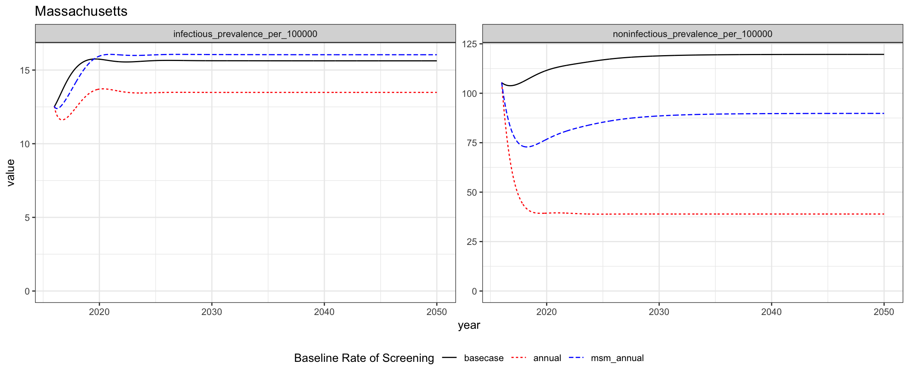

In this project we are modeling syphilis in Louisiana and Massachusetts. 

In each of these two states, we have calibrated the model and can use it to
simulate hypothetical scenarios which may yield useful insight into effective
health policy. 

This document will walk readers through the background of the model, an analysis of
two hypothetical interventions, and our intentions for future developments.

## Model Background 

#### Data Being Used

Calibration targets include: 

- Reported Cases by Stage, Sex, Race
- Proportion of Male Cases Among MSM
- Proportion of Cases Among MSM with HIV Coinfection
- Subpopulation Assortative Mixing (Age, Race)

#### Model Structure

{ width=6in }

{ width=6in }

#### Calibration 

In order to calibrate our model, we run an optimization algorithm to determine
several parameter vectors which optimize the model fit to the prior and
likelihood distributions.  These parameter vectors are then used as the
starting places for multiple Monte Carlo Markov Chains which are used to
estimate model uncertainty.

|Louisiana|Massachusetts|
|---------|-------------|
|{ width=4.5in }|{ width=4.5in }|
#### Visualizations of the Modeled Epidemiology

[More content intended to go here, e.g. proportion of prevalence among race/gender/age/MSM/hiv-status/etc.]

## Intervention Analysis

The primary research question we have been investigating has been: 

> How do interventions which are focused on raising the baseline level of
> screening in the entire population compare to interventions targeted on men who have sex
> with men (MSM) populations? 

<!--{ width=8in }-->

The following outputs are in measures of infections per 100,000. 

For reference, the assumed population sizes of Louisiana and Massachusetts 
are 2,787,423 and 4,230,601 respectively (assumed from 2015 census estimates).

#### Prevalence and Incidence 
#### Basecase, Annual, and MSM Annual Screening Scenarios

{ width=8in } 
{ width=8in } 

#### Infectious and Noninfectious Prevalence 
#### Basecase, Annual, and MSM Annual Screening Scenarios

{ width=8in } 
{ width=8in } 

#### Discussion 

In the above depicted scenarios, we have simulated the outcomes of 
three scenarios: the basecase, where screening is maintained at 
2015 levels indefinitely into the future, the annual scenario, 
where everyone receives at least annual screening, and the 
msm_annual screening where msm receive at least annual screening
but all other populations' screening levels are maintained
at their 2015 levels.

In both settings, screening the entire population at least annually is
effective at reducing the number of prevalent infections. 

In Louisiana, annual screening reduces the incidence rate. However, in
Massachusetts the incidence rate is reduced for a few years, but ultimately
stabilizes at a higher rate than the basecase incidence rate.

In Massachusetts, screening MSM at least annually averts prevalent infections,
but does increase the incidence rate. However, in Louisana screening MSM 
annually without changing any other populations' screening levels ultimately 
increases the prevalence rate beyond the basecase rate after an initial
period of reduction in prevalence.

We believe that this effect is due to the re-infection of individuals who had
latent infectious and are treated who may then become infectious after
re-infection. The second set of figures shows that the msm_annual intervention
scenario yields a short-term reduction in both infectious and non-infectious 
syphilis followed by a sharp increase in the prevalence of infectious syphilis
above the basecase infectious prevalence level. This explains why in both settings
we see that the msm_annual intervention increases incidence. 

## Future Plans

We will be analyzing interventions like these in further depth to
determine scenarios that could make for effective prevention policy. 

To investigate the counterintuitive effect that screening MSM annually has, 
we will be investigating the impact of increasing screening levels in those
susceptible to re-infection.
